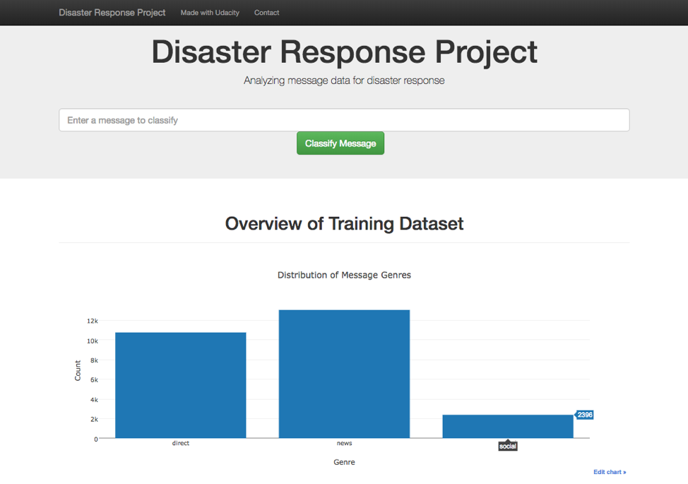
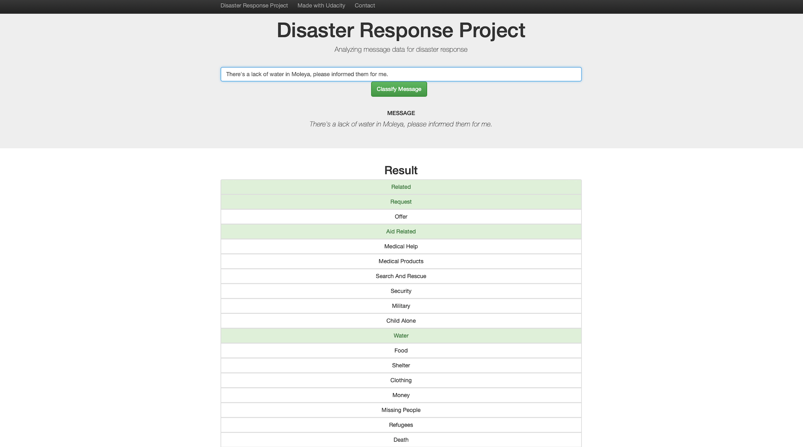

<!DOCTYPE html>
<html>
<body>
 
<h1>Disaster Response Classification with ETL and Machine Learning pipeline</h1>

image source: www.datanami.com

 
 

In this project, we will analyze disaster data from Figure Eight (in data directory) to build a model for a flask based API that classifies disaster messages.

There are two data sets, one contains real messages that were sent during disaster events, and second is the categories that the message belong. We created a machine learning pipeline to categorize these events so that you can send the messages to an appropriate disaster relief agency.

This project includes a flask web app where an emergency worker can input a new message and get classification results in several categories. The web app will also display visualizations of the data.

This picture is the main page of the application that displays the input space for the message search. For instance, the message "There's a lack of water in Moleya, please informed them for me." is submitted. 

 

 

In this next picture we will see how the categories of the message will look like:
 

 

<h2> Project Components </h2>
There are three components you'll need to complete for this project. 
<ul> 1. ETL Pipeline
In a Python script, process_data.py, write a data cleaning pipeline that:
<li>	Loads the messages and categories datasets </li>
<li>	Merges the two datasets </li>
<li>	Cleans the data </li>
<li>	Stores it in a SQLite database </li>
 </ul>
<ul>2. ML Pipeline
In a Python script, train_classifier.py, write a machine learning pipeline that:
<li>	Loads data from the SQLite database </li>
<li>	Splits the dataset into training and test sets </li>
<li>	Builds a text processing and machine learning pipeline </li>
<li>	Trains and tunes a model using GridSearchCV </li>
<li>	Outputs results on the test set </li>
<li>	Exports the final model as a pickle file </li>
 </ul>
<ul> 3. Flask Web App </li>
<li> File paths for database and model as needed </li>
<li>	Add data visualizations using Plotly in the web app </li>
</ul>

Two juputer source files are also included as ETL_Pipeline.ipynb and ML_Pipeline.ipynb that comprehensively show all the ETL and ML pipeline steps. Some improved ML pipeline methods are included in the ML_Pipeline.ipynb file, but are not hooked up in the app because they were so slow to run.  

<h2> Instructions to run the web app </h2>
Please do the following steps:

<ul> 1. Run the following commands in the project's root directory to set up your database and model.

       To run ETL pipeline that cleans data and stores in database 
         `python data/process_data.py data/disaster_messages.csv data/disaster_categories.csv data/DisasterResponse.db` 
         
       To run ML pipeline that trains classifier and saves:
         `python models/train_classifier.py data/DisasterResponse.db models/classifier.pkl` 
</ul>

<ul> 2. Run the following command in the app's directory to run your web app.
    `python run.py` </ul>

<ul> 3. Go to http://0.0.0.0:3001/ </ul>

</body>
</html>
